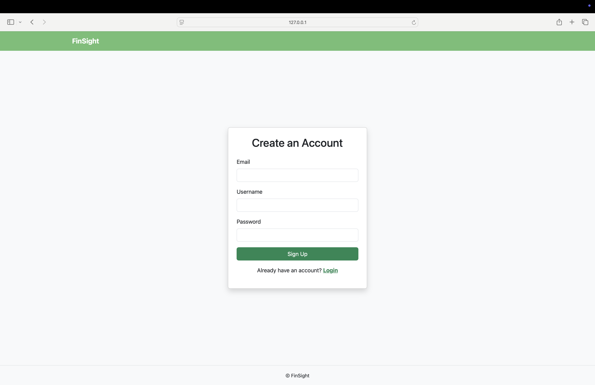
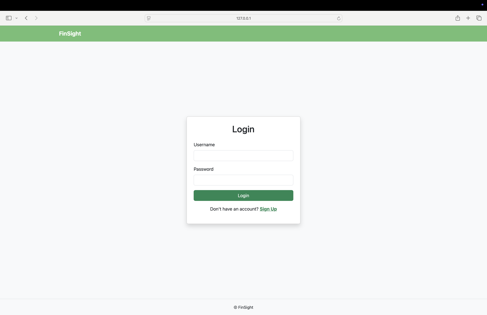
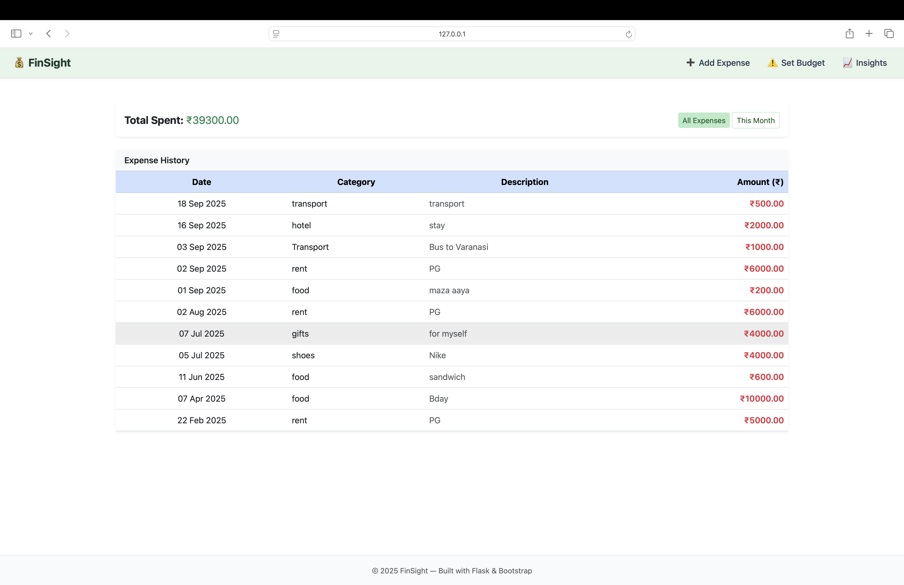
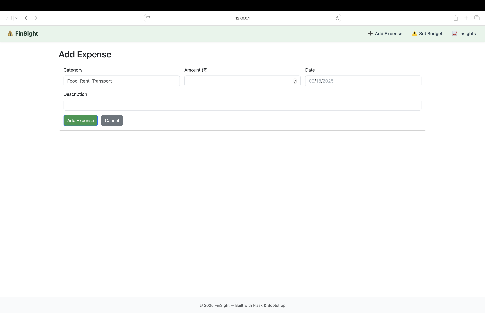
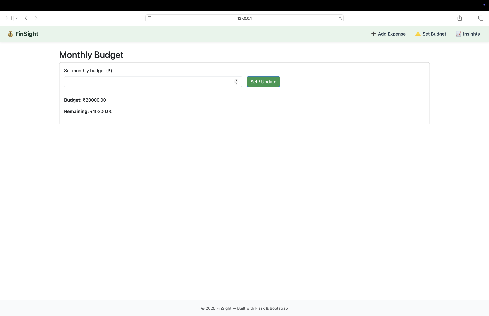
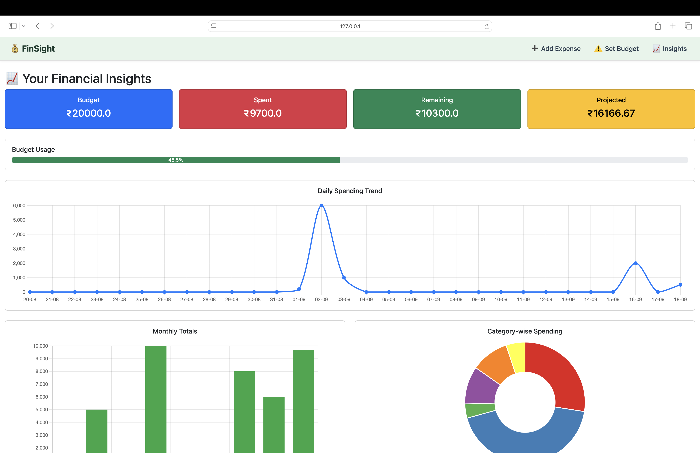
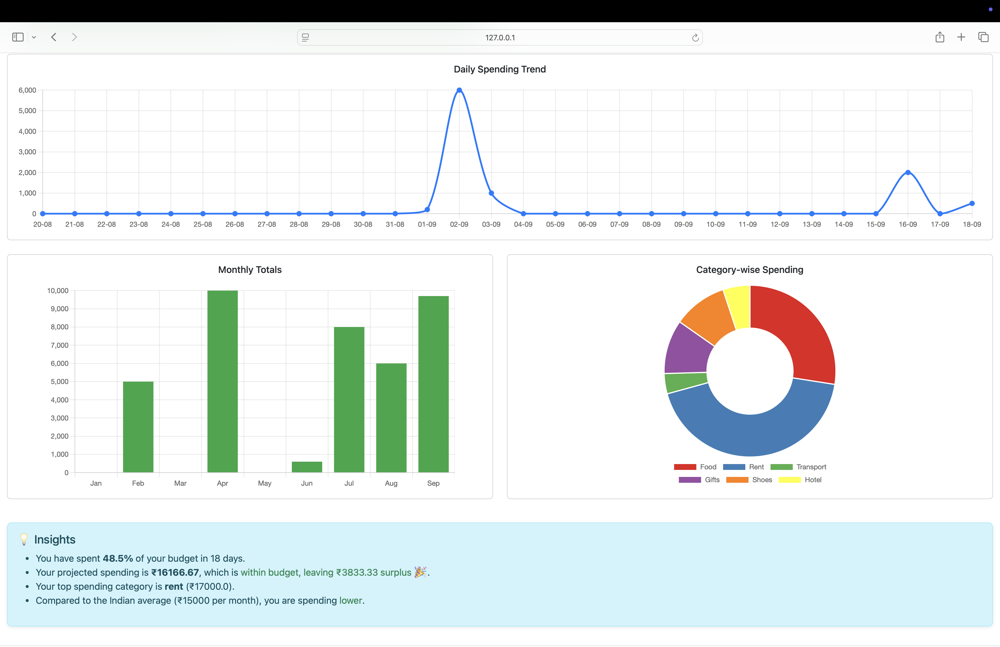

# 💰 FinSight  

A simple, smart, and lightweight expense tracker built with **Flask**, **SQLite**, and **Bootstrap**.  
It helps you manage daily expenses, set monthly budgets, and gain insights with charts & analytics.  

---

## ✨ Features  

✅ User Authentication (Sign Up / Login)  
✅ Add, View, and Filter Expenses (all-time or monthly)  
✅ Set Monthly Budget with Remaining Balance Calculation  
✅ Insights Dashboard:  
   - Daily expenses (last 30 days, line chart)  
   - Monthly spending trend (bar chart)  
   - Category-wise distribution (pie chart)  
   - Projected monthly expenses  
✅ Simple, responsive UI (Bootstrap + custom styling)  
✅ Deployed-ready with `gunicorn`  

---

## 📸 Screenshots  


- **Signup Page**  
    

- **Login Page**  
    

- **Home**  
  

  - **Add Expense**  
    

- **Set Budget**  
    

- **Insights with Charts**  
  
    

---

## 🚀 Installation  

Clone the repository:  
```bash
git clone https://github.com/your-username/smart-expense-tracker.git
cd smart-expense-tracker

---

## create virtual Environment and activate

python3 -m venv venv
source venv/bin/activate   # Mac/Linux
venv\Scripts\activate      # Windows

---

## Install dependencies and Run 

pip install -r requirements.txt
python app.py

---

## 📦 Deployment

gunicorn -w 4 -b 0.0.0.0:5000 app:app

---

## 🛠️ Tech Stack

Backend: Flask (Python)
Database: SQLite + SQLAlchemy ORM
Frontend: Bootstrap 5 + Chart.js
Auth: Flask-Login
Deployment: Gunicorn

---

## 👨‍💻 Contributing

Pull requests are welcome! If you’d like to add new features or fix bugs, please open an issue first to discuss.

---

⭐ If you like this project, don’t forget to star the repo!
